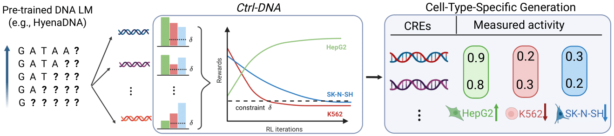

# Ctrl-DNA: Controllable Cell-Type-Specific Regulatory DNA Design via Constrained RL

We present Ctrl-DNA, a constrained reinforcement learning framework for the controllable design of cell-type-specific regulatory DNA sequences. Ctrl-DNA fine-tunes autoregressive genomic language models by framing sequence generation as a biologically informed constrained optimization problem. Using a value-model free, Lagrangian-guided policy optimization strategy, Ctrl-DNA iteratively refines sequences to maximize gene expression in a target cell type while suppressing activity in off-target cell types. Applied to human enhancer and promoter datasets, Ctrl-DNA generates biologically plausible, high-fitness sequences enriched for key transcription factor motifs, achieving state-of-the-art specificity and performance in regulatory sequence design.



## Installation

Clone the repository and install the required dependencies:

```bash
git clone https://github.com/bowang-lab/Ctrl-DNA.git 
cd ctrl-dna
pip install -r requirements.txt
```

## Data Preprocessing

We follow the preprocessing pipeline from [Genentech/regLM](https://github.com/Genentech/regLM). Please refer to their repository for detailed instructions.
